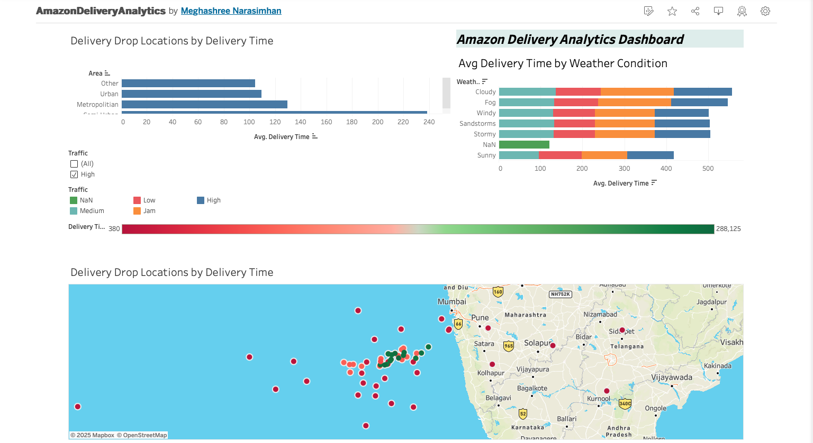
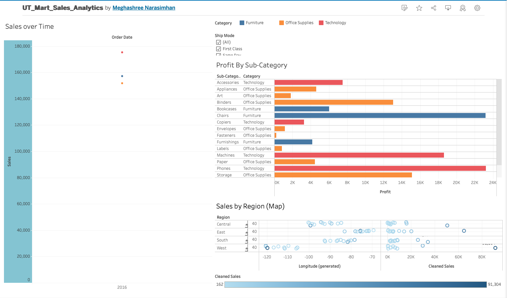

# Tableau Project Portfolio

This repository showcases a collection of interactive Tableau dashboards built using real-world public datasets.

## 📦 Projects Included

### 1. Amazon Delivery Analytics
- Analyzes delivery time by area, traffic, and weather
- Tools: Tableau Public, CSV
- File: `Amazon_Delivery_Analytics.twbx`
- 🔗 [View Dashboard on Tableau Public](https://public.tableau.com/app/profile/meghashree.narasimhan/viz/AmazonDeliveryAnalytics/Dashboard1?publish=yes)
  

### 2. Tesla Stock Price Dashboard
- Visualizes Tesla stock trends, moving averages, and volume
- Tools: Tableau Public, CSV
- File: `Tesla_Stock_Dashboard.twbx`
- 🔗 [View Dashboard on Tableau Public](https://public.tableau.com/app/profile/meghashree.narasimhan/viz/Tesla_17491483909620/TeslaStockPriceAnalysisDashboard?publish=yes)
  

### 3. UT Mart Sales Analytics
- Sales breakdown by product category, customer region, and time
- Tools: Tableau Public, CSV
- File: `UT_Mart_Sales_Analytics.twbx`
- 🔗 [View Dashboard on Tableau Public](https://public.tableau.com/app/profile/meghashree.narasimhan/viz/UT_Mart_Sales_Analytics/Dashboard1?publish=yes)
  

## 📂 Datasets
- Sourced from Kaggle and GitHub
- Included as `.csv` files alongside dashboards

## 🚀 View Dashboards Online
[Tableau Public Portfolio](https://public.tableau.com/app/profile/meghashree.narasimhan/vizzes)

## 🛠 Tools Used
- Tableau Public
- CSV (Kaggle)
- Git & GitHub
